# NomadAdventureV2

`NomadAdventureV2` нь Монголын түүх, аялал жуулчлал, соёлын контентыг тоглоомчилсон байдлаар үзүүлэх зорилготой дипломын хэмжээний AR прототип төсөл юм.

Энэ төсөл 3 үндсэн хэсгээс бүрдэнэ:

- `Unity`:
  AR scene, 3D model, collectible reward, preview логик
- `Expo / React Native`:
  гар утасны үндсэн app, map, login, collection, profile, navigation
- `Node.js + Express + Prisma + PostgreSQL/PostGIS`:
  backend API, хэрэглэгч, tourism spot, reward, claim, collection data

Энэ repo нь ганц Unity project биш, ганц mobile app ч биш. Бүрэн системээрээ нэг дор байгаа.

## Төслийн үндсэн санаа

Хэрэглэгч апп руу орж:

1. Нэвтэрнэ
2. Ойр байгаа tourism spot-уудыг map дээрээс харна
3. Нэг spot сонгоод AR scene рүү орно
4. Тухайн байршилтай холбоотой reward-ийг claim хийнэ
5. Claim хийсэн зүйл нь collection дотор хадгалагдана
6. Дараа нь collection-оос тэр reward-аа AR preview байдлаар дахин үзэж болно

Өөрөөр хэлбэл энэ төсөл бол:

- байршилд суурилсан
- өгөгдлөөр тэжээгддэг
- Unity AR + mobile UI hybrid
- collectible system-тэй аяллын prototype юм

## Энэ төсөл яг яаж ажилладаг вэ

Системийн урсгал дараах байдлаар ажиллана:

```mermaid
flowchart LR
  A["Хэрэглэгч Mobile App нээнэ"] --> B["React Native UI"]
  B --> C["Backend API-гаас user болон spot data авна"]
  C --> D["Map дээр nearby spots харуулна"]
  D --> E["Хэрэглэгч spot сонгоно"]
  E --> F["React Native Unity руу payload явуулна"]
  F --> G["Unity AR scene ачаална"]
  G --> H["AR дээр reward / collectible гарна"]
  H --> I["Claim хийхэд backend руу request явна"]
  I --> J["Reward collection-д хадгалагдана"]
  J --> K["Collection screen-ээс reward preview AR mode-оор дахин харна"]
```



### 1. React Native хэсэг юу хийдэг вэ

`NomadApp/` доторх Expo / React Native хэсэг нь хэрэглэгчийн харах бүх үндсэн UI-г удирдана.

Үүнд:

- login screen
- home / map screen
- nearby spot list
- reward success screen
- collection screen
- profile screen
- Unity AR screen рүү navigation хийх логик

React Native нь backend-аас өгөгдөл авна, дараа нь Unity рүү:

- ямар spot нээгдэж байгаа
- ямар reward харагдах ёстой
- preview mode эсэх
- camera permission status

гэсэн payload-уудыг дамжуулдаг.

### 2. Unity хэсэг юу хийдэг вэ

Unity хэсэг нь AR болон 3D interaction-ийн бүх логикийг ажиллуулна.

Үүнд:

- AR scene ачаалах
- AR camera ажиллуулах
- reward model байрлуулах
- collectible object tap хийх
- collection preview үед model-ийг урд талд гаргах
- React Native-с ирсэн payload-ийг унших
- React Native руу status буцаах

Unity дээр хамгийн чухал файлууд:

- `Assets/Scripts/NativeBridgeManager.cs`
- `Assets/Scripts/NomadARRuntimePermissionGate.cs`
- `Assets/Scripts/ARChestSpawner.cs`
- `Assets/Scripts/ARChestRewardCollectible.cs`
- `Assets/Scripts/Collection/CollectedRewardARPreviewSpawner.cs`
- `Assets/Scripts/Collection/CollectedRewardPreviewController.cs`
- `Assets/Scenes/ARScene.unity`

### 3. Backend хэсэг юу хийдэг вэ

`backend/` нь mobile app болон Unity хоёрын ашиглах өгөгдлийг хадгалж, API хэлбэрээр өгдөг.

Backend нь:

- guest login
- demo login
- email OTP verification
- tourism spot list
- nearby spot query
- reward claim
- user reward history

зэрэг API-уудыг өгнө.

Database дээр хадгалагдах үндсэн entity-үүд:

- `User`
- `EmailOtp`
- `Reward`
- `TourismSpot`
- `UserReward`

## Төслийн бүтэц

```text
NomadAdventureV2/
├── Assets/                          # Unity script, scene, resource, prefab
├── Packages/                        # Unity package configuration
├── ProjectSettings/                 # Unity project settings
├── NomadApp/                        # Expo / React Native mobile app
│   ├── app/                         # route болон screen-үүд
│   ├── components/                  # UI component-ууд
│   ├── context/                     # state management
│   ├── ios/                         # native iOS project
│   ├── scripts/                     # iOS run helper script
│   ├── services/                    # backend API service
│   ├── unity/                       # Unity export/build artifact
│   └── withUnity.js                 # Expo + Unity холбох custom plugin
├── backend/                         # Express + Prisma backend
│   ├── prisma/                      # schema, migration, seed
│   ├── src/                         # controller, route, middleware, utils
│   └── README.md                    # backend-ийн дэлгэрэнгүй README
├── DIPLOMA_PRESENTATION_DOC_MN.md   # presentation notes
└── Дипломын_тайлан.pdf              # тайлан PDF
```

## Хамгийн чухал folder-ууд

Хэрэв багш эхлээд code review хийх гэж байгаа бол дараах хэсгүүдийг үзэхэд хамгийн ойлгомжтой:

- Unity gameplay logic:
  `Assets/Scripts/`
- Unity AR scene:
  `Assets/Scenes/ARScene.unity`
- Mobile app:
  `NomadApp/`
- Backend:
  `backend/`

## Ашигласан технологи

### Unity

- Unity `2022.3.62f3`
- AR Foundation
- ARKit
- C#

### Mobile App

- Expo `54`
- React Native `0.81`
- Expo Router
- Mapbox
- `@azesmway/react-native-unity`

### Backend

- Node.js `22+`
- Express
- Prisma
- PostgreSQL
- PostGIS
- Zod

## Local орчинд ажиллуулах заавар

## 1. Backend асаах

Backend folder руу орно:

```bash
cd backend
```

Dependency суулгана:

```bash
npm install
```

`.env` үүсгэнэ:

```bash
cp .env.example .env
```

Дараах утгуудыг тохируулна:

- `DATABASE_URL`
- `JWT_SECRET`
- `OTP_SECRET`

Хэрэв demo login ашиглах бол:

- `ALLOW_DEMO_LOGIN=true`

Database бэлдээд дараах command-уудыг ажиллуулна:

```bash
npm run prisma:generate
npm run prisma:deploy
npm run prisma:seed
npm run dev
```

Backend default-аар:

```text
http://localhost:4000
```

дээр асна.

Health check endpoint:

```text
GET /health
```

## 2. Mobile app асаах

Mobile app folder руу орно:

```bash
cd NomadApp
```

Dependency суулгана:

```bash
corepack enable
corepack yarn install
```

`.env` файл үүсгэнэ:

```bash
cp .env.example .env
```

Шаардлагатай хувьсагч:

- `EXPO_PUBLIC_API_URL`
- `RNMAPBOX_MAPS_DOWNLOAD_TOKEN`

iOS pod install:

```bash
cd ios
pod install
cd ..
```

## 3. App ажиллуулах

### Simulator дээр

UI болон navigation тест хийх бол:

```bash
corepack yarn ios --simulator
```

Энэ үед mock Unity mode ашиглагдана. Өөрөөр хэлбэл:

- UI харагдана
- navigation ажиллана
- backend integration шалгаж болно
- гэхдээ жинхэнэ AR camera feed ажиллахгүй

### Physical iPhone дээр

Жинхэнэ AR тест хийх бол:

```bash
corepack yarn ios --device
```

Анхаарах зүйлс:

- AR camera зөвхөн physical iPhone дээр бүрэн ажиллана
- iOS Simulator дээр real AR feed ажиллахгүй
- утас unlock хийгдсэн байх хэрэгтэй
- Xcode trust / Developer Mode тохирсон байх ёстой

## Unity ба React Native хоёр яаж холбогддог вэ

Энэ төслийн хамгийн чухал техникийн хэсэг бол Unity-г mobile app дотор embed хийсэн явдал.

Энгийнээр тайлбарлавал:

1. React Native app Unity screen-ийг нээнэ
2. React Native Unity руу JSON payload явуулна
3. Unity payload-ийг parse хийгээд:
   ямар mode дээр нээгдэхээ шийднэ
4. Unity AR scene дээр object-оо гаргана
5. Unity статус буцааж React Native-д илгээнэ
6. Claim хийхэд React Native/backend flow руу буцаж орно

### React Native-с Unity рүү дамжих мэдээлэл

Жишээ нь:

- spot id
- spot name
- reward id
- reward name
- preview prefab key
- collection preview mode эсэх
- camera permission granted эсэх

### Unity-с React Native руу буцах статус

Жишээ нь:

- `native_unity_initialized`
- `loading_scene`
- `ar_initializing`
- `waiting_for_camera_frame`
- `ready`
- `error`

## Unity iOS export яаж ажилладаг вэ

Unity талд өөрчлөлт орвол iOS runtime-г дахин export хийх шаардлагатай.

Editor дотор:

```text
Nomad Adventure > Build > Export iOS Xcode Project
```

гэсэн menu ашиглана.

Энэ нь дараах folder руу export хийнэ:

```text
NomadApp/unity/source/ios
```

Дараа нь:

- `UnityFramework.framework`
- Unity `Data`

файлуудыг React Native app-ийн ашиглах folder руу sync хийдэг.

Runtime artifact-ийн байрлал:

```text
NomadApp/unity/builds/ios
```

Анхаарах зүйл:

- энэ repo дотор Unity-ийн build artifact аль хэдийн байгаа
- Unity C# code, scene, asset өөрчлөгдөөгүй бол заавал дахин export хийх шаардлагагүй

## AR хэсэг яаж ажилладаг вэ

AR scene дотор үндсэндээ дараах бүтэц ашиглана:

- `AR Session`
- `AR Session Origin` эсвэл `XR Origin`
- `AR Camera`
- `AR Camera Manager`
- `AR Camera Background`
- `Tracked Pose Driver`

AR ажиллахын тулд:

- ARKit enable байх
- camera permission granted байх
- physical iPhone ашиглах

Хэрэглэгч collection preview нээхэд:

1. React Native Unity рүү preview payload явуулна
2. Unity preview prefab key ашиглан model олно
3. Model-ийг AR camera-ийн урд байрлуулна
4. Tap/drag/pinch interaction ажиллана

## Backend API-ууд

Энэ төсөлд хамгийн чухал endpoint-ууд:

- `POST /auth/guest-login`
- `POST /auth/demo-login`
- `POST /auth/email/request-otp`
- `POST /auth/email/verify-otp`
- `GET /spots`
- `GET /spots/nearby`
- `GET /spots/:id`
- `POST /spots/:id/claim`
- `GET /users/me/rewards`
- `GET /users/:id/rewards`

## Demo хийх урсгал

Хэрэв багшид demo үзүүлэх бол дараах дарааллаар үзүүлэхэд хамгийн ойлгомжтой:

1. Backend асаана
2. Mobile app-аа утсан дээр асаана
3. Demo login эсвэл guest login хийнэ
4. Map screen дээр nearby spot-ууд харуулна
5. Нэг spot сонгоно
6. Unity AR scene рүү орно
7. Reward claim хийнэ
8. Collection screen рүү орж claimed reward-аа харуулна
9. Reward-аа AR preview mode-оор дахин нээнэ

## Энэ төслийн онцлог

Энэ prototype-ийн гол үнэ цэнэ нь:

- Unity, mobile app, backend гурвыг нэг систем болгосон
- location-aware тоглоомчилсон концепцтой
- AR interaction урсгалтай
- claim болон collection state-ийг backend-аар удирдаж байгаа
- Монголын аялал, өв соёлын контентийг орчин үеийн interactive хэлбэрт оруулсан

## Хязгаарлалт

- AR-г бүрэн шалгахын тулд physical iPhone хэрэгтэй
- PostGIS байхгүй бол nearby spot query бүрэн ажиллахгүй
- Unity export artifact байгаа тул repo хэмжээ том
- Unity integration custom тул dependency upgrade хийхдээ болгоомжтой байх ёстой

## Багшид review хийх санал болгож буй дараалал

Хэрэв багш энэ repo-г нээж шалгах бол дараах дарааллаар үзвэл ойлгомжтой:

1. Энэ `README.md`-г эхэлж унших
2. `backend/README.md`-г уншиж API хэсгийг ойлгох
3. `NomadApp/README.md`-г уншиж mobile app setup харах
4. `Assets/Scripts/`-ийг хараад Unity logic-ийг шалгах
5. Боломжтой бол simulator дээр UI-г ажиллуулах
6. Финал шалгалтад physical iPhone дээр AR flow-г турших

## Нэмэлт баримтууд

- Mobile app notes:
  `NomadApp/README.md`
- Backend documentation:
  `backend/README.md`
- Presentation notes:
  `DIPLOMA_PRESENTATION_DOC_MN.md`
- Тайлан PDF:
  `Дипломын_тайлан.pdf`

---

Хэрэв source code-оор нь л түргэн танилцах бол эхлээд:

- `Assets/Scripts/`
- `NomadApp/app/`
- `backend/src/`

гэж үзэхэд хангалттай.

Харин бүр ажиллуулж үзэх бол:

1. `backend/`
2. `NomadApp/`
3. шаардлагатай үед Unity export/build

гэсэн дарааллаар явах нь зөв.
